# cmx-flowengine 流程引擎 · 完整技术方案

> **版本** v0.1.12 · **文档日期** 2026-08-19 · **定位** 面向人本审批场景的轻量级 BPMN 子集流程引擎
>
> 语言 Rust（edition 2024）· 约 27,000 行源码 · 11 个 crate · 120+ 集成测试 · 一芯多壳可独立部署可平台内嵌
>
> 本文基于源码逐项核对生成，功能/性能描述均以代码为准（不含未实现能力的过度承诺）。

---

## 目录

1. [产品定位与设计铁律](#一产品定位与设计铁律)
2. [总体架构：一芯多壳](#二总体架构一芯多壳)
3. [Crate 分层与依赖](#三crate-分层与依赖)
4. [令牌执行模型](#四令牌执行模型)
5. [节点类型全景（13 类）](#五节点类型全景13-类)
6. [能力里程碑 M1–M5](#六能力里程碑-m1m5)
7. [子流程与路由维度泛化](#七子流程与路由维度泛化)
8. [可注入扩展点](#八可注入扩展点)
9. [数据模型与持久化](#九数据模型与持久化)
10. [多租户隔离](#十多租户隔离)
11. [无头契约与集成](#十一无头契约与集成)
12. [性能特性](#十二性能特性)
13. [前端微前端三壳](#十三前端微前端三壳)
14. [API 接口全景](#十四api-接口全景)
15. [部署形态](#十五部署形态)
16. [能力边界与路线](#十六能力边界与路线)

---

## 一、产品定位与设计铁律

cmx-flowengine 是一款用 **Rust** 实现的 **BPMN 2.0 子集**工作流引擎，聚焦**人本审批**赛道（对标 Flowable 的人本层、钉钉/飞书审批引擎），而非通用编排或云原生大规模流程引擎。它的核心价值是：**语义中立的执行内核 + 一芯多壳的部署弹性 + 审批场景的完整人机协同能力**。

### 设计铁律

| 铁律 | 含义 | 体现 |
|------|------|------|
| **内核语义中立** | 执行内核不认识任何数据库、组织、框架 | `cmx-flow-model` 零 DB/cmx 依赖，可 wasm 嵌入 |
| **等待态即提交点** | 每个 BPMN 等待态 = 一个 DB 事务 | `save_snapshot` 单事务，一段推进一次提交 |
| **永不 panic 落 trace** | 任何节点失败挂 Incident 而非崩溃/丢实例 | serviceTask/子流程失败 → 令牌转 Incident，可 retry |
| **BPMN 只是交换格式** | 引擎跑干净 IR，不在运行期解析 XML | `cmx-flow-bpmn` 编译期 XML→IR |
| **扩展点可注入** | 外部能力经 trait 注入，内核不硬编码 | Clock/Delegate/AssigneeResolver/SubflowRouter |
| **向后兼容** | 新能力默认关闭或缺省等价旧行为 | 多租户默认 single、维度默认 org |

### 定位坐标

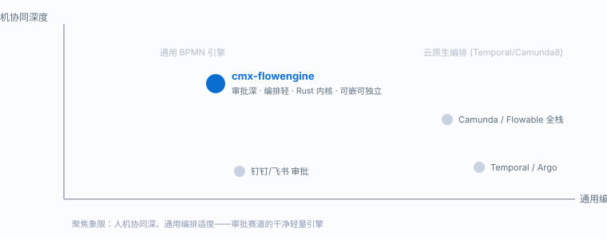

---

## 二、总体架构：一芯多壳

「一芯多壳」是 cmx-flowengine 最核心的架构决策：**一个平台中立的应用核 `cmx-flow-app`**，被多个「壳」复用——平台内嵌壳、独立微服务壳、无头契约壳。核心通过泛型路由 `flow_routes::<S>()` 对任意宿主状态 `S` 成立，handler 不绑 `State` 提取器，因此**两个壳复用同一套 handler + 同一张路由表，零业务漂移**。

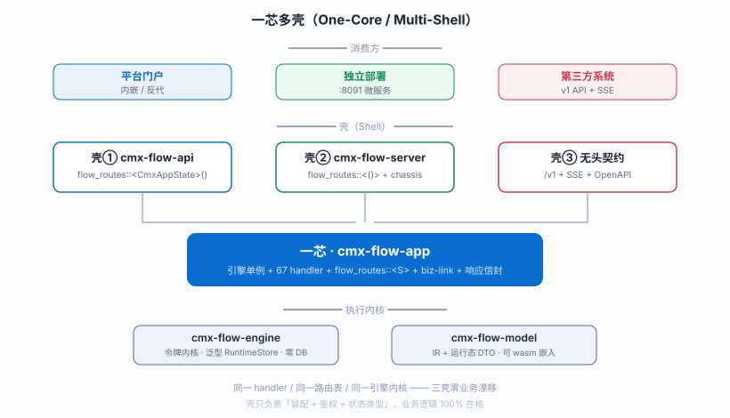

**三种部署姿态**：
- **① 平台内嵌**：`cmx-flow-api` 作为 cmx-container 平台的一个模块，`flow_routes::<CmxAppState>()` 挂进平台路由，与平台共享进程/鉴权。
- **② 独立微服务**：`cmx-flow-server` 独立进程（:8091），经 `cmx-web-chassis` 装配，零平台依赖；平台经反向代理壳 `FlowProxyModule` 接回（配置 `[center_client.urls].flow` 决定内嵌还是反代）。
- **③ 完全无头**：第三方直接消费 `/api/flow/v1/*` + SSE 事件流 + OpenAPI，自建 UI。

---

## 三、Crate 分层与依赖

11 个 crate 严格分层，依赖单向向下。内核层（model/engine）**零基础设施依赖**，可 wasm 嵌入；持久化/适配层实现内核定义的 trait；应用层装配 handler；壳层只做部署装配。

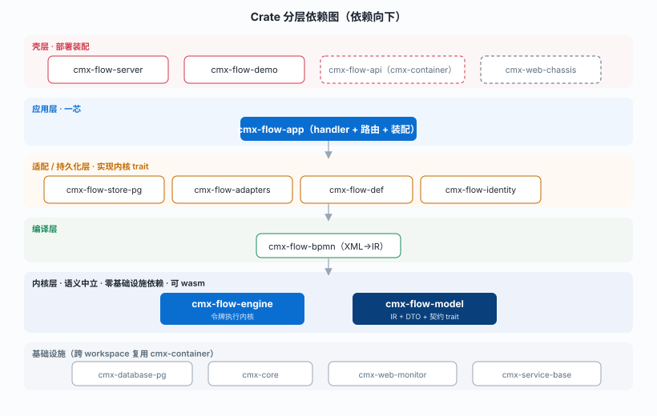

| Crate | 职责 | 关键约束 |
|-------|------|---------|
| **cmx-flow-model** | 语义中立内核：IR（arena+索引）、运行态 DTO、变量、受控条件表达式引擎、决策表、`RuntimeStore` 契约 trait | **零 cmx/DB 依赖，可 wasm** |
| **cmx-flow-bpmn** | BPMN 2.0 XML → IR 编译器（roxmltree 零拷贝 DOM） | 命名空间无关，不支持元素显式报错 |
| **cmx-flow-engine** | 令牌执行内核；不变式「等待态=提交点」；泛型于 `RuntimeStore` | 只依赖 model 的中立契约 |
| **cmx-flow-def** | 流程定义持久化（草稿/发布/版本/装载） | 两表：definition + version |
| **cmx-flow-store-pg** | PostgreSQL `RuntimeStore` 实现 + PG 版解析器/路由器 | 聚合快照单事务读写 |
| **cmx-flow-adapters** | 外部服务适配（S1）：三注入 trait 的 Http+Mock + webhook 发送器 | 只依赖引擎 trait 层 |
| **cmx-flow-identity** | 可选内建身份模块（`fid_*` 表），`FLOW_IDENTITY_MODE=local` 才激活 | 绝不冒充平台 IAM |
| **cmx-flow-app** | 一芯：引擎单例 + 全 handler + `flow_routes::<S>()` + biz-link | 不依赖 cmx-api |
| **cmx-flow-server** | 独立 bin 壳（:8091），填一份 ServiceSpec | 零平台依赖 |
| **cmx-flow-demo** | 自包含 axum 演示（:8090），内联 SPA | — |
| **cmx-flow-tests** | E2E 测试；默认内存态，PG 测试 `#[ignore]` 门控 | 120+ 测试函数 |

---

## 四、令牌执行模型

引擎的核心抽象是 **令牌（Token）**——BPMN 语义里流经流程图的执行指针。令牌持 `node_bpmn_id`（稳定 BPMN id 锚点，非内存索引，故跨进程重启安全）+ 状态。执行主循环 `run_to_wait` 反复取第一个 `Active` 令牌推进其节点，直到再无活动令牌——**每个等待态恰好对应一次 DB 事务提交**。

### 4.1 一段推进的生命周期

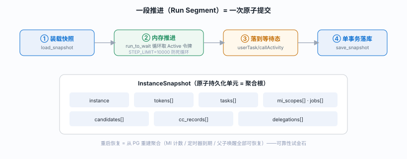

**IR 设计要点**：arena `Vec<FlowNode>` + `NodeId(usize)` 索引（无 `Rc<RefCell>` 图）；`NodeKind` 枚举分派（非继承树）；`bpmn_id` 作稳定持久化锚点。

### 4.2 令牌状态机

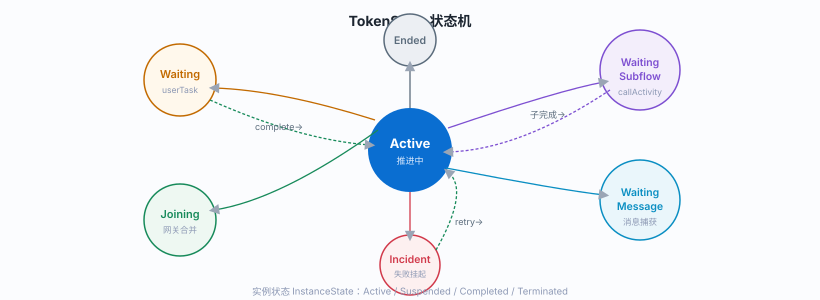

---

## 五、节点类型全景（13 类）

引擎支持 **13 类 BPMN 节点**，覆盖审批场景的全部编排原语。其中仅 **userTask** 与 **callActivity** 是等待态（落库挂起），其余在一段推进内同步执行完毕。

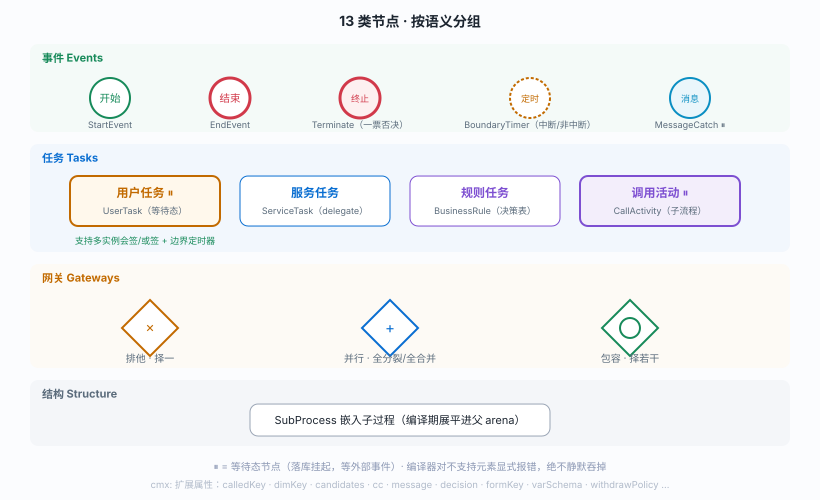

### 条件表达式引擎

分支条件走**手写受控 DSL**（非 FEEL）：递归下降文法（`||`/`&&`/比较/算术/一元/函数调用/括号），剥离 `${...}`/`#{...}` 包裹，返回 JSON 真值。支持点路径访问（`order.amount`）+ 21 个内置纯函数（LEN/UPPER/CONTAINS/IN/ABS/ROUND/MIN/MAX/COALESCE/IF/NOT…）。**刻意不含时间函数**——时间只经可注入 `Clock` 进入，保确定性可测。空表达式 = true（无条件边）。

---

## 六、能力里程碑 M1–M5

引擎能力沿 M1→M5 逐里程碑演进，每一步都以「审批场景真实诉求」驱动。下图为能力演进时间线。

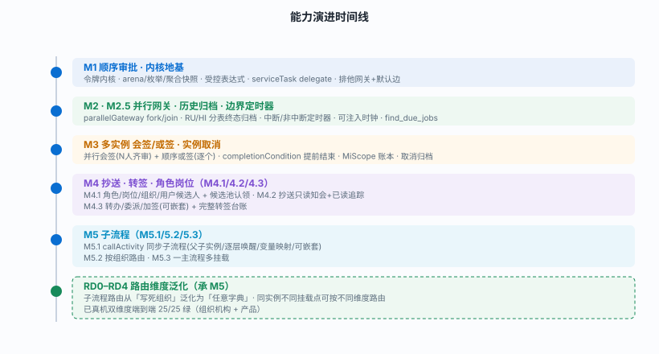

### 6.1 多实例（会签/或签）

把一个逻辑 userTask 展开成多个并发/顺序子任务，用 `cmx_flow_mi_scope` 记账（total/completed/next_index/collection 快照）。

- **会签（parallel）**：一次展开全部元素，N 人齐头并进；`completionCondition` 可提前结束（注入 `nrOfInstances`/`nrOfCompletedInstances`/`nrOfActiveInstances`）。命中条件即作废剩余任务、发一个代表令牌前进。
- **或签（sequential）**：逐个展开，前一个办完再展开下一个。
- **集合驱动**：由 JSON 数组变量驱动展开（非 loopCardinality）；每元素办理人支持三种写法——元素插值 `${product.ownerUser}`、候选表达式插值 `role(${product.ownerRole})`、用户 id 集合。

### 6.2 边界定时器（M2.5）

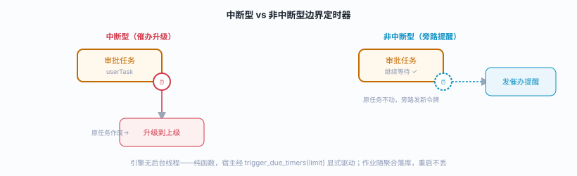

### 6.3 人机协同动作全集

审批赛道的完整人工干预能力，每个动作都写 `TaskDelegation` 台账留痕：

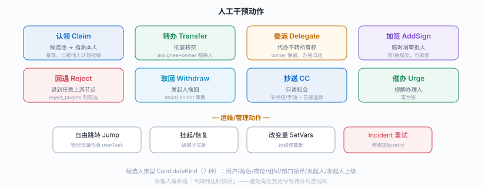

### 6.4 失败处理：永不 panic 落 trace（Incident 模型）

serviceTask delegate 失败**不中断推进、不丢实例**：令牌转 `Incident` 态，`record_incident` 把原因 + 累计重试次数写进实例变量 `__incident`（按节点 bpmn_id 键的 JSON，无新表）。实例仍 `Active`，其它分支继续跑，`hasIncident` 对运维台可见。`retry_incident` 重新激活所有 Incident 令牌重跑；子流程解析失败复用同机制（未路由/未部署/无路由器 → Incident 而非丢僵尸实例），修好绑定后 retry 即可穿过 callActivity。

---

## 七、子流程与路由维度泛化

子流程是审批场景的高频诉求：**同一主流程，不同维度（组织/法人/产品…）跑不同的中间审批链**。主流程 callActivity 不写死调哪个子流程，而写一个**逻辑 key**，运行期由 `SubflowRouter` 按维度取值解析成具体子流程定义。

### 7.1 路由维度泛化（RD0–RD4）

M5.2 最初把路由维度**写死为组织机构**。RD0–RD4 把它泛化为**任意字典**：一个 `dimKey` 选择用哪个字典（内建 `org`，或任意 `cf_*` 字典），`dimValue` 是实例在该维度上的取值。核心突破——**同一主流程实例，不同挂载点可按不同维度路由**。

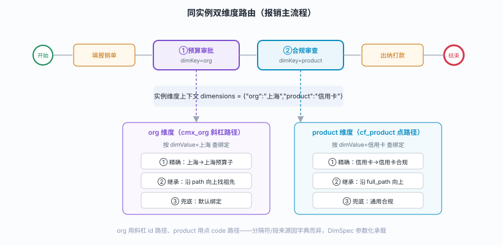

**三层解析**（精确 → 沿维度字典物化路径继承 → 默认兜底）对**任意自分级字典同构**：组织用 `cmx_org.path`（斜杠/id 段），产品用 `cf_product.full_path`（点/code 段），仅分隔符和段来源不同，由 `DimSpec{table, id_col, path_col, delim}` 参数化承载。平级字典无「上级」概念，天然只走精确+兜底。

**RD 阶梯**：RD0 契约泛化（`resolve` 三参 + `CallActivity.dim_key` + BPMN 解析）→ RD1 PgSubflowRouter DimSpec + 自分级继承 → RD2 绑定表 `dim_key`/`dim_value` + 端点 → RD3 实例维度上下文 → RD4 设计器。已真机双维度端到端 **25/25** 绿。

### 7.2 多挂载去重（M5.3）

一个主流程多处挂载不同子流程时，去重键是 `(parent_token_id, parent_node_bpmn_id)`——一个令牌串行经过多个 callActivity，每个挂载点独立起子流程。子流程复用完整内核，故子流程也能有多实例/定时器/转签。

---

## 八、可注入扩展点

引擎内核零外部依赖，外部能力经 **trait 注入**（4 个）或 **注册表按 key**（2 个）接入。选择模式经 `AdapterConfig::from_env()`（mock/http/pg，默认全 pg）。

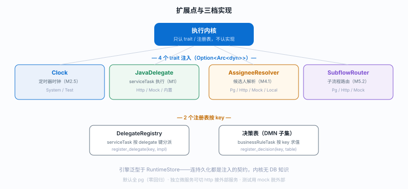

`AssigneeResolver` 两档 API：`resolve`（非关系型 User/Role/Position/Org）+ `resolve_with(ctx)`（关系型 OrgLeader/Initiator/InitiatorLeader，用 `ResolveContext{initiator, org_id}`）。

---

## 九、数据模型与持久化

PostgreSQL 存储，硬约束：`cmx_flow_` 前缀、**无外键**（索引替代）、DDL 幂等。表分 **RU（运行态）** 与 **HI（历史态）** 两类；终态实例在同一事务归档到 HI 表（含存续时长），供 SLA/时效分析。

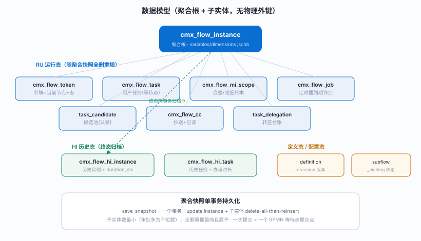

---

## 十、多租户隔离

**db-per-tenant** 物理隔离（S2）。默认 `single` 模式零回归；`multi` 模式下每租户一套库/引擎/定义/webhook。

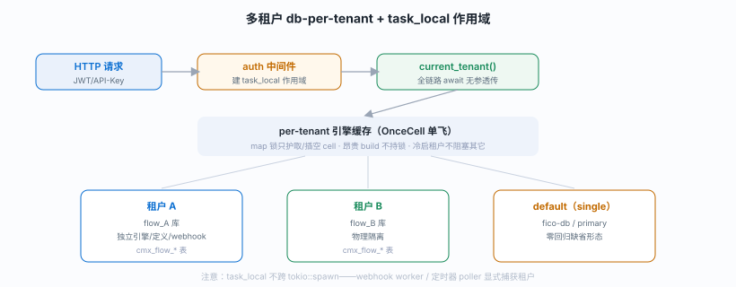

---

## 十一、无头契约与集成

面向第三方的对外契约四件套（S3–S6）：**v1 前缀 + SSE 事件流 + Webhook + OpenAPI**，加平台集成的 **反向代理壳 + 委托令牌桥**。

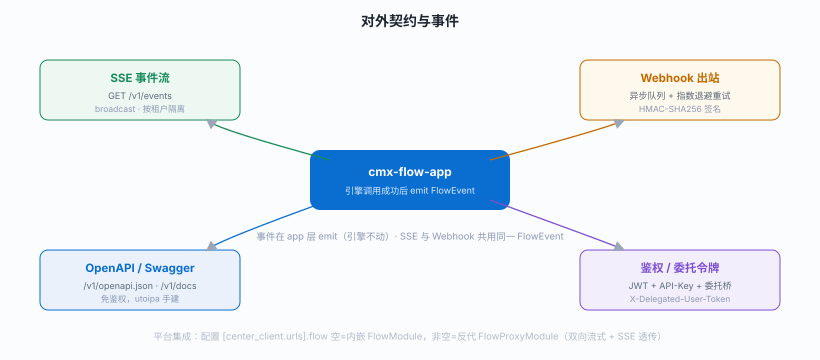

**生命周期事件**：`instance.started/completed/terminated`、`task.created/completed/reassigned`。**S6 委托令牌桥**：API-Key 分支额外解 `X-Delegated-User-Token`（始终验签），租户取自委托令牌的 claim 而非 key 绑定的租户——让平台以「服务身份 + 终端用户身份」双重上下文调用独立引擎。

---

## 十二、性能特性

引擎性能建立在 **Rust 零成本抽象 + tokio 全异步 + 聚合快照最小化 IO + 纯函数无后台线程** 四个支点上。

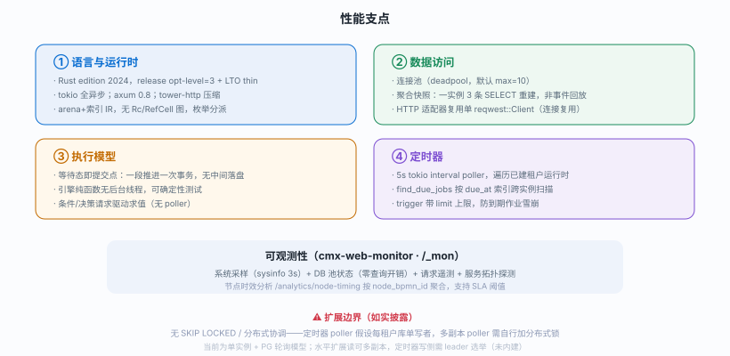

**关键性能数字与设计**：

| 维度 | 特性 |
|------|------|
| 编译产物 | release `opt-level=3` + `lto="thin"`；distroless 运行镜像无 shell |
| 连接池 | deadpool，默认 `max_connections=10`（测试 1）；池状态零开销暴露给监控 |
| 持久化 IO | 一段推进 = 一次事务；聚合子实体全删重插（审批场景个位数行，原子且最简） |
| 恢复模型 | 快照重建（3 SELECT），非事件回放；重启从 PG 恢复半成品流程 |
| 定时器 | 纯函数引擎 + 外部 5s poller；`find_due_jobs` 按 `due_at` 索引；`limit` 防雪崩 |
| 条件/决策 | 请求驱动纯函数求值，无 poller、无后台线程 |
| HTTP 适配 | 单 `reqwest::Client` 连接复用；User/Initiator 本地短路省往返 |

---

## 十三、前端微前端三壳

「前端一芯三壳」——共享一份 S4 抽取的 native-page 核（`web/core/`），三种消费形态：

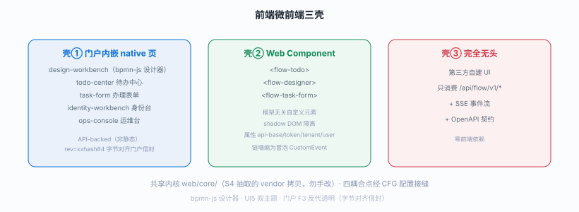

---

## 十四、API 接口全景

约 67 个端点，两前缀（`/flow/*` 兼容 + `/flow/v1/*` 正式）。按域分组：

| 域 | 端点（择要） |
|----|-------------|
| **定义** | `GET/POST /definitions`、`/definitions/draft`、`/definitions/validate`、`/definitions/{key}/publish`、`/definitions/{key}/versions`、`.../activate`、`/definitions/{key}/variables` |
| **实例** | `POST /instances`、`/instances/{id}`、`/cancel`、`/suspend`、`/resume`、`/jump`、`/withdraw`、`/set-variables`、`/retry-incident`、`/children`、`/comments`、`/variables`、`/biz` |
| **任务** | `/tasks/my`、`/tasks/{id}/complete`、`/claim`、`/transfer`、`/delegate`、`/addsign`、`/reject`、`/reject-targets`、`/urge` |
| **待办中心** | `/todos/initiated`、`/todos/cc`、`/todos/done`、`/todos/filters`、`/startable` |
| **抄送** | `/cc`、`/cc/{id}/read` |
| **子流程路由** | `/orgs`、`/dimensions`、`/dimension/{dimKey}/entries`、`/subflow-bindings`、`.../{key}`、`.../id/{id}` |
| **决策/条件** | `/decisions`、`/decisions/evaluate`、`/conditions/eval`、`/conditions/validate`、`/conditions/functions` |
| **表单/身份** | `/forms/{key}`、`/identity/{entity}`、`/identity/mode`、`/users`、`/clients` |
| **消息/定时器** | `/messages/correlate`、`/timers/trigger` |
| **监控/契约** | `/stats`、`/stats/detail`、`/analytics/node-timing`、`/events`（SSE）、`/openapi.json`、`/docs` |

响应信封统一 `{code, msg, data}`——成功 `code:0`，业务失败 HTTP 200 + `code:1`。

---

## 十五、部署形态

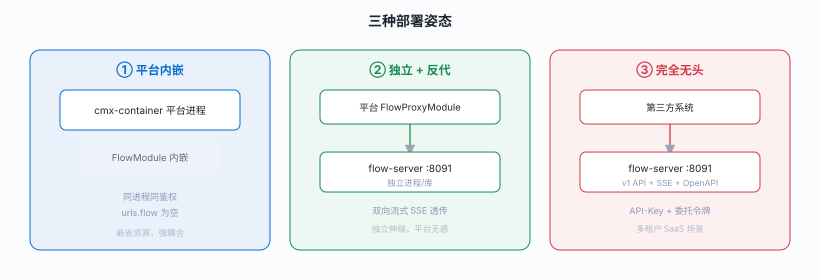

**容器化**：多阶段 Dockerfile（rust builder → distroless/cc-debian12 无 shell 运行时，配置全 env，EXPOSE 8091）；docker-compose（postgres 18 + fico/cmx 双库 + flow-server）。启动经 `cmx-web-chassis::run(spec)` 装配：分层日志（控制台 + 滚动 JSON 文件）→ 有序异步初始化钩子（数据源注册 + 定时器 poller）→ 路由装配 → 监控挂载 → 优雅停机。

---

## 十六、能力边界与路线

### 已实现能力总览

| 类别 | 能力 |
|------|------|
| **节点** | 13 类：开始/结束/终止、用户/服务/规则任务、排他/并行/包容网关、边界定时器、消息捕获、调用活动、嵌入子过程 |
| **多实例** | 会签（并行）+ 或签（顺序）+ completionCondition + 集合驱动 |
| **人机协同** | 认领/转办/委派/加签（可嵌套）/回退任意节点/取回/抄送/催办 |
| **候选人** | 用户/角色/岗位/组织/部门领导/发起人/发起人上级（7 类）+ 候选池认领 |
| **子流程** | 同步子流程 + 按任意维度字典路由 + 多挂载 + 变量映射 |
| **定时器** | 中断/非中断边界定时器 + 可注入时钟 |
| **运维** | 跳转/挂起恢复/改变量/Incident 重试/节点时效分析 |
| **契约** | v1 API + SSE + Webhook + OpenAPI + 多租户 + 委托令牌 |

### 诚实的能力边界（不过度承诺）

- **事件系统**：仅边界定时器 + 消息捕获；无信号/错误/补偿/升级/条件/链接事件。
- **网关**：无事件网关、复杂网关。
- **规则**：决策表是 DMN 子集 + 手写受控 DSL 条件，非完整 FEEL/DMN（如需完整规则能力，配 cmx-rulesengine）。
- **扩展性**：单实例 + PG 轮询模型；无 SKIP LOCKED / 分布式 poller 协调 / 实例版本迁移。
- **读路径**：当前走 DataSet/query_sql，未接零拷贝 ZmcDataSet（待办/实例列表是手工投影小 JSON）。

### 定位总结

> cmx-flowengine 是一款**设计干净、审批扎实的轻量 BPMN 子集引擎**，在人本审批赛道（对标 Flowable 人本层）提供完整的人机协同 + 灵活的子流程维度路由 + 一芯多壳的部署弹性。它不追求通用编排或云原生大规模，而是把「审批场景做深做透 + Rust 内核可靠可嵌」作为核心竞争力。

---

*本文档基于 cmx-flowengine v0.1.12 源码逐项核对生成。功能/性能描述以代码为准，图示为内嵌 SVG（可离线渲染）。相关详细设计见 docs/ 下各专题文档（SUMMARY.html 里程碑总览、schema.md 表结构、enhancement-detail-06 维度路由、standalone-microservice-design.html 独立微服务、full-test/ 测试报告）。*
